# Awesome-Cloud-Customer-Onboarding

# Awesome-Cloud-Customer-Onboarding 🚀 ✅

  

  

  

  

  

  

  

---

## 🌟 Top Cloud Customer Onboarding Ecosystem

**Curated List of Commercial Onboarding Platforms & Open-Source Customer Success Tools**  

*Focused on Implementation Project Management, Client Portals, Automated Checklists, In-App Product Tours & Self-Hosted Onboarding Workflows*

**Last updated: October 2026** 📅

---

### 📌 Overview & SEO Summary

Welcome to the ultimate curated directory of **cloud customer onboarding platforms**, **open-source client portal tools**, and **product-led growth frameworks**. Whether you are looking for enterprise-grade commercial solutions (such as *GuideCX*, *Rocketlane*, and *Gainsight*), or self-hostable open-source alternatives (like *Usertour*, *Laudspeaker*, and *Atrium*), this list covers category leaders, implementation trackers, and privacy-respecting customer success infrastructure.

---

## 📑 Table of Contents

- [🏢 SaaS & Commercial Platforms](#-saas--commercial-platforms)

- [🔓 Open-Source GitHub Projects](#-open-source-github-projects)

- [🛠️ How to Contribute](#%EF%B8%8F-how-to-contribute)

- [📊 Star History](#-star-history)

- [🤝 Support & Sponsorship](#-support--sponsorship)

- [⚠️ Disclaimer](#%EF%B8%8F-disclaimer)

---

## 🏢 SaaS / Commercial Platforms

The customer onboarding market spans **implementation project management platforms** (GuideCX, Rocketlane) that orchestrate complex B2B deployments, **customer success platforms** (Gainsight, ChurnZero) that monitor post-sale health, and **product-led onboarding tools** (Userflow, Appcues) that guide users inside the application. Pricing models are typically **per-seat or per-account**, with enterprise tiers scaling significantly. **GuideCX** pioneered the **client-facing onboarding portal** model, inviting customers and third-party vendors into the project for complete visibility . **Rocketlane** differentiates through **professional services automation** with financial oversight and project collaboration . **Baton** focuses on **automating project administration** and status tracking for implementation teams .

| SaaS / Commercial Platform | Company / Owner | Valuation / Market Cap | Standard Edition Starting Price | Free Tier / Free Trial Limits | Description |

| :--- | :--- | :--- | :--- | :--- | :--- |

| **[GuideCX](https://www.guidecx.com/)** 🧭 | GuideCX | Private | Custom enterprise pricing | **Free trial available** | **Client onboarding and implementation platform** — **Client-facing portal** invites internal teams, customer teams, and third-party vendors into the project . Automated tasks, reminders, and updates. Customers complete tasks via portal, mobile app, or email . |

| **[Rocketlane](https://www.rocketlane.com/)** 🚀 | Rocketlane | Private | Custom per-seat pricing | **Free trial available** | **Professional services automation and onboarding** — Project management, customer collaboration, and **financial oversight** for timely, budget-conscious delivery . Serves SaaS, fintech, and marketing industries . |

| **[Baton](https://www.baton.io/)** 🎯 | Baton | Private | Custom enterprise pricing | **Demo available** | **Software implementation management** — Automates project administration and status tracking for implementation teams . Focus on reducing manual coordination overhead. |

| **[Setuply](https://setuply.com/)** ⚙️ | Setuply | Private | Custom enterprise pricing | **Demo available** | **Client onboarding automation** — Streamlines the onboarding process through automation, collaboration tools, and real-time project visibility. Integrates with CRM systems to reduce churn . |

| **[Dock](https://www.dock.us/)** 📋 | Dock | Private | Custom per-seat pricing | **Free trial available** | **Sales enablement and onboarding** — Collaborative workspaces for sales proposals, onboarding plans, and customer-facing content. |

| **[Arrows](https://arrows.to/)** ➡️ | Arrows | Private | Custom per-seat pricing | **Free trial available** | **Customer onboarding and success** — Shared action plans, automated reminders, and progress tracking. Integrates with CRM and project tools. |

| **[Gainsight](https://www.gainsight.com/)** 📊 | Gainsight | Private | Custom enterprise pricing | **Demo available** | **Customer success platform** — Health scoring, playbooks, and renewal management. **Read-only dashboards** with static rule engines requiring manual intervention . |

| **[ChurnZero](https://churnzero.com/)** 🔄 | ChurnZero | Private | Custom enterprise pricing | **Demo available** | **Customer success platform** — Real-time health monitoring, usage analytics, and automated playbooks. Focus on reducing churn through proactive engagement. |

| **[Planhat](https://www.planhat.com/)** 🌱 | Planhat | Private | Custom per-seat pricing | **Free trial available** | **Customer platform** — Unified customer data, health scoring, and automation. **Nordic-designed** with strong European presence. |

| **[Userflow](https://userflow.com/)** 🎨 | Userflow | Private | Custom per-seat pricing | **Free trial available** | **Product-led onboarding** — Build in-app tours, checklists, and surveys without code. The **open-source alternative is Usertour** . |

---

## 🔓 Open-Source GitHub Projects

*Sorted by GitHub_Stars_Count (Descending)* 🌟

- **[Chatwoot](https://github.com/chatwoot/chatwoot)**   

  **Open-source omnichannel support desk (Intercom/Zendesk alternative)**, MIT licensed. **25K+ stars**. **Built-in dashboard** showing total messages, response times, and resolution times. **Custom Attributes** store account-level data for segmentation and onboarding triggers. **Self-hosted deployment** for full data control. **The foundation for customer communication during onboarding** — ticket history, conversation context, and team assignment all in one place . 💬

- **[Laudspeaker](https://github.com/laudspeaker/laudspeaker)**   

  **Open-source customer engagement and product onboarding platform**, open-source. **2,216+ stars, 153 forks** . **The open-source alternative to Braze, One Signal, Customer.io, Appcues, and Pendo** . **Design product onboarding flows** and send product and event-triggered emails, SMS, push, and more . **No-code journey builder** for cross-channel customer journeys . **New channels**: SMS and Firebase push . **Time delays and time windows** for drip campaigns. **User segments** and **database imports** (Postgres, CSV) . **Self-host or use hosted offering** — keep control of customer data . 🚀

- **[Usertour](https://github.com/usertour/usertour)**   

  **Open-source user onboarding platform**, open-source. **1,444 stars, 79 forks** . **Create in-app product tours, checklists, and surveys in minutes** — effortlessly and with full control. **The open-source alternative to Userflow and Appcues** . **TypeScript-based** with active development (last pushed 2 days ago). **Self-hosted** for complete data ownership. **The direct open-source competitor to the product-led onboarding SaaS category** . 🎨

- **[CXM-Tool](https://github.com/antigravitysoham-eng/CXM-Tool)**   

  **Advanced Customer Experience Management Platform**, open-source. **Full-stack CX Portal** built with React, Vite, Express, and SQLite . **Onboarding Tracker**: step-by-step milestone tracking from kickoff to launch with **real-time progress updates for every account** . **CLM (Contract Lifecycle Management)**: track contract stages, pipeline value, and renewal dates. **Portfolio Management**: interactive dashboard with Gross/Net Retention, Churn Risk, and upcoming Renewals . **Health Checks**: proactive account scoring and risk categorization. **Customer Training**: centralized hub for enablement and certification progress . **AI Co-pilot**: context-aware assistant for NPS, account health, and revenue forecasting queries. **Connectivity Hub**: OAuth2/API key management for Zoho CRM, Salesforce, HubSpot . **The most feature-complete open-source CX management platform**. 🚀

- **[Atrium](https://github.com/vibralabs/atrium)**   

  **Self-hosted client portal for agencies and freelancers**, open-source. **Replaces shared drives, spreadsheets, and scattered emails** with a single branded portal your clients can log into . **Project management** with customizable status pipeline per organization. **File sharing** via S3, MinIO, Cloudflare R2, or local storage. **White-label branding** — custom colors and logo applied to the client portal . **Role-based access** — Owner/admin for your team, member role for clients. **Email notifications** via Resend. **Built-in PostgreSQL** — no separate container needed . **Docker one-liner deployment** with single required environment variable (`BETTER_AUTH_SECRET`). **The simplest self-hosted client onboarding portal** . 🏛️

- **[ClientShare](https://github.com/pixelcop/clientshare)**   

  **Secure, branded client portal for teams**, open-source. **Keep client files in one place** instead of scattered across inboxes and shared links . **Give clients a clean upload and download experience** with branded portal settings. **Control access** with users, roles, permissions, and **secure links**. **Start with SQLite and local storage**, then move to Postgres, MySQL, or S3-compatible storage when needed . **Expiring secure links** for controlled external access. **Email-driven workflows** for invites and password resets. **Branding controls** for site title, logo, and primary color. **Local-first self-hosting defaults** with optional hosted-oriented tenancy mode. **Vue frontend bundled into the Go app** for a single deployable service . 🔒

- **[Helio](https://github.com/achref-soua/helio)**   

  **Open-source growth platform with AI-native marketing automation**, open-source. **CDP, segmentation, cross-channel journeys, email, analytics** . **Self-hostable, data-sovereign**. **Sustains ~20,000 events/s at p95 81ms** — 4× the ≥5,000 events/s budget . **PostgreSQL row-level security** for multi-tenant isolation enforced at the database. **Journey sends run on Temporal** with explicit retry policies. **Docker Compose profiles** for local/self-host topologies. **Kubernetes Helm chart** for production deployment . **The most technically rigorous open-source growth/onboarding platform** — built for scale from day one. 🚀

- **[LibrePlan](https://github.com/LibrePlan/libreplan)**   

  **Open-source web-based project management platform**, AGPL licensed. **Used internationally since 2009** . **v1.6.0 released May 2026** with **issue and risk log management**, **project document repositories**, **project pipeline overview**, **project status indicators**, and **expanded email notifications** . **Self-hosted solution** for on-premises or sovereign cloud environments. **Deployable in independent infrastructure environments** without dependency on proprietary cloud services. **Container images on Docker Hub**. **The most mature open-source project governance platform** — relevant for onboarding complex enterprise implementations . 🏛️

- **[CheckCheck](https://github.com/motey/checkcheck)**   

  **Collaborative, offline-capable checklist application**, open-source. **Web UI + REST API** . **Status: 1.0 stable** for personal use and small, trusted groups. **Docker image available** (451.6 MB). **The simplest self-hosted checklist tool** for onboarding task tracking. **Hobby project with single maintainer** — not for enterprise-scale deployments . ✅

- **[Kanbus](https://github.com/kanbus/kanbus)**   

  **Tiny Jira clone for your repo**, open-source. **Git-native project management** — files are the database . **One issue per file** eliminates merge conflicts when teams or agents edit in parallel. **No SQL server, no JSONL merge conflicts, no daemon**. **Jira vocabulary** (Epics, Tasks, Sub-tasks) that AI models are pre-trained on. **Wiki Engine** renders Markdown templates with live issue data . **Zero cost footprint** — if you have a git repository, you already have the database. **The most developer-friendly open-source project tracker** for onboarding engineering-heavy customers. 📝

- **[FileRise](https://github.com/FileRise/FileRise)**   

  **Web file manager with client portals**, open-source (Pro version for portals). **v2.0 released November 2025** with **customizable client portals and intake forms** . **Individual portals per customer** with URL slug, expiration dates, and branding (title, instruction text, footer, accent color). **Intake forms** capture name, email, reference number, and notes before upload. **Submissions log** tracks date, target folder, user, IP, and form values . **GDPR-compliant self-operation** without cloud dependencies. **PHP-based, runs on Apache**. **The open-source alternative to file-collection portals** during customer onboarding . 📁

- **[Blueberry AI](https://github.com/23140-ITP/blueberry-ai)**   

  **Proactive Customer Success Intelligence**, open-source. **Autonomous, context-aware CS Copilot** that reduces **mean-time-to-escalation from 3 days to 15 minutes** . **Aggregates fragmented signals** (tickets, call transcripts, CSM notes) into one semantic timeline. **Dynamic ES|QL risk scoring** computes churn-risk models in real-time. **Autonomous escalation via MCP** — reads context, reasons over churn risks, drafts Slack payload, and writes escalation events back into Elasticsearch . **Built with Google Cloud Agent Builder + Elastic Agent Builder MCP**. **The most advanced open-source customer success intelligence layer** — read-and-write paradigm, not read-only dashboards . 🫐

- **[Open Checklists](https://github.com/open-checklists/open-checklists)**   

  **Sharable checklist format**, open-source. **JSON-based specification** for checklists — shopping lists, PR checklists, new employee onboarding, and more . **Structured format** with title, description, authors, and items (each with content_text and optional media). **Extensions** via `_` prefixed fields for custom data. **The simplest way to define onboarding checklists in a portable format** . 📋

- **[Team Onboarding Plugin (bb)](https://github.com/gperezmz/bb-plugins)**   

  **Live setup checklist for your team**, MIT licensed. **Define team setup once in `onboarding.yaml`** — GitHub access, SSH, agent logins, skills, plugins, tools, and custom checks . **Checks each item on every machine** where agents run, **fixes it when it safely can**, and **opens a terminal with the right command when it can't**. **Keeps checking** — a new team skill or expired login shows up automatically . **The most agent-native onboarding checklist tool** — designed for AI-augmented engineering teams. 🤖

---

## 🛠️ How to Contribute

Contributions are welcome! Follow these steps to submit new customer onboarding platforms or open-source customer success software:

1. 🍴 **Fork** the repository.

2. 📝 **Add/edit** entries in `README.md` maintaining table/list structure and formatting.

3. 🔗 Include project title, official website/GitHub link, exact Stars_Count, license, and brief description.

4. 🚀 Submit a **Pull Request** with a descriptive summary of your changes.

---

## 📊 Star History

---

## 🤝 Support & Sponsorship

If you find this customer onboarding repository useful, please consider supporting the project:

- ⭐ **Star** this repository to increase visibility!

- 🔀 **Fork** and share with fellow customer success engineers, onboarding specialists, and open-source advocates.

- ☕ **Sponsor & Buy Me a Coffee**: Support ongoing open-source curation via the [GitHub Sponsor Dashboard](https://github.com/sponsors/ishandutta2007).

---

## ⚠️ Disclaimer

- This is a **community-curated** list — not exhaustive and not an endorsement. ℹ️

- **Open-source customer onboarding tools are not free** — Laudspeaker, Usertour, and Atrium are excellent with zero license cost, but their real cost is **a person**. Someone runs upgrades, wires integrations, configures email delivery, and answers questions when a customer's portal breaks. If your CS team is one person with a full workload, a paid tool with support is cheaper in practice.

- **CheckCheck is a hobby project with a single maintainer** — stable for personal use and small trusted groups, but **not for enterprise-scale deployments** . **FileRise Pro is required for client portal functionality** — the core version lacks the intake forms and portal management features .

- **Blueberry AI requires Elasticsearch Serverless and Google Cloud Agent Builder** — it is a reference implementation, not a turnkey product. **Integrating live webhook ingestion from Zendesk and Salesforce is on the roadmap** .

- **Gainsight and ChurnZero use static rule engines** — their dashboards are **read-only** and require manual intervention to map fragmented telemetry data. **They surface problems but don't act on them** .

- Open-source solutions (Laudspeaker, Usertour, Atrium, CXM-Tool) provide self-hosted ownership and transparency, but enterprise-grade SLA guarantees, managed email delivery infrastructure, and 24/7 support remain primarily commercial offerings. **Always validate onboarding flows with real customer data** before rolling out at scale. 🚀

---

  <b>Made with ❤️ for customer success engineers, onboarding specialists, and open-source CS advocates.</b>

